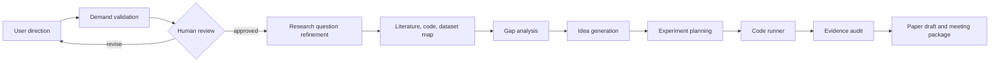

# NoviScope

[中文文档](README.zh-CN.md)

Evidence-driven research workflow for turning vague research directions into verified
experiments and traceable paper drafts.

[](#development)
[](#api)
[](#current-status)

NoviScope is designed for computer-vision research groups that need to move from
an imprecise topic to a defensible research idea, experiment plan, evidence trail,
and paper draft. The long-term target is a digital research team that can search
papers, map existing work, propose novelty, reproduce baselines, run ablations,
audit claims, and produce paper and meeting materials with provenance.

This repository currently contains the first backend foundation slice. It does not
yet implement full literature retrieval, GPU experiment execution, or paper/PPT
generation.

## Why NoviScope

Many research ideas fail before the experiment stage because the demand is vague,
the application scenario is weak, or the proposed novelty is not grounded in
existing work. NoviScope is meant to make that loop explicit:

- Start from a short research direction, not a fully specified task.
- Verify whether the demand reflects a real scenario before experiments.
- Connect every idea to papers, datasets, code, assumptions, and risks.
- Keep experiment results traceable enough to feed into a paper draft.
- Let humans approve critical gates, especially demand validity and experiment claims.

Example directions:

- Handwritten text erasure for restoring used exam papers.
- AI + sports research, such as badminton trajectory recognition or action recognition.
- Other machine-vision tasks where novelty, baseline choice, and application value need
  early validation.

## Research Workflow



The intended final output is not just text. NoviScope should produce a tracked
research package:

- demand validation report
- paper and baseline matrix
- gap and limitation map
- candidate ideas with falsifiable experiments
- lightweight feasibility results
- full experiment and ablation records
- evidence audit report
- English paper draft, Chinese paper draft, and Chinese meeting slides

## Agent Team

NoviScope models the research process as a 9-agent team. The current foundation
stores the agent contract registry and exposes it through the API.

| Agent | Goal | Key Outputs |
| --- | --- | --- |
| Demand Validator | Check whether the direction reflects a real application demand. | demand report, confidence, source risks |
| Research Refiner | Convert a broad direction into a scoped CV research question. | research brief, scope, keywords |
| Literature Scout | Build the paper, code, dataset, and baseline map. | bibliography matrix, taxonomy, baselines |
| Gap Analyst | Identify limitations and improvement space. | gap matrix, limitation map |
| Idea Generator | Generate evidence-linked hypotheses. | candidate ideas, idea risk table |
| Experiment Planner | Turn selected ideas into experiment and ablation plans. | experiment plan, metric plan |
| Code Runner | Run local reproduction, evaluation, and ablation jobs. | provenance, logs, metrics |
| Evidence Auditor | Audit source truth and claim-result alignment. | source audit, claim audit, blockers |
| Paper & Meeting Writer | Produce paper drafts and meeting materials. | English draft, Chinese draft, slides |

Only `code_runner` has the `run_code` permission in the registry.

## Current Status

Implemented foundation slice:

- FastAPI backend scaffold.
- SQLModel domain models for providers, agent assignments, quests, and stage cards.
- SQLite setup with foreign-key enforcement.
- Model gateway abstraction with provider profiles and adapter registration.
- Immutable 9-agent registry with deterministic API serialization.
- Quest service that creates a first `demand_validator` stage.
- HTTP API for health checks, agent listing, and quest creation.
- Secret redaction and private outbound upload guard helpers.
- Test suite covering security, models, agents, gateway, quests, and API behavior.

Not implemented yet:

- real literature retrieval from arXiv, Semantic Scholar, Google Scholar, IEEE, ACM, or CVF
- demand-source crawling and poisoning-risk scoring
- GPU job scheduling on the lab A800 server
- baseline reproduction automation
- experiment artifact registry
- evidence auditor execution logic
- paper and PPT generation
- web frontend

## API

Run the service:

```bash
uvicorn noviscope.main:app --reload
```

Health check:

```bash
curl -s http://127.0.0.1:8000/health
```

List the built-in agent contracts:

```bash
curl -s http://127.0.0.1:8000/agents
```

Create a research quest:

```bash
curl -s -X POST http://127.0.0.1:8000/quests \
  -H "Content-Type: application/json" \
  -d '{"title":"AI+Sports Badminton","initial_direction":"AI+体育，羽毛球"}'
```

The response includes a `draft` quest and a first stage assigned to
`demand_validator`.

## Development

Install dependencies:

```bash
python -m venv .venv
source .venv/bin/activate
pip install -e ".[dev]"
```

Run tests:

```bash
pytest
```

Run lint:

```bash
ruff check .
```

Run API locally:

```bash
uvicorn noviscope.main:app --reload
```

Use a custom SQLite database path:

```bash
NOVISCOPE_DATABASE_URL=sqlite:///./noviscope.db uvicorn noviscope.main:app --reload
```

## Repository Layout

```text
src/noviscope/
  agents/          Built-in research-agent contracts.
  api/             FastAPI routes and response schemas.
  core/            Settings, secret redaction, outbound data safety.
  db/              Database engine, schema, and session helpers.
  model_gateway/   Provider profile and adapter abstraction.
  models/          SQLModel domain models.
  quests/          Research quest workflow service.
tests/             Unit and API tests.
docs/superpowers/  Design specs and implementation plans.
```

## Safety Model

NoviScope is being designed for research workflows where trust matters more than
volume. The foundation already includes the following safety constraints:

- API keys are represented with redaction-aware types in the gateway profile.
- `.env`, SQLite databases, virtual environments, and local tool caches are ignored.
- Private code, datasets, logs, checkpoints, and unpublished drafts are modeled as
  protected outbound data classes.
- Private outbound upload requires explicit user approval.
- Experiment-capable permissions are isolated to the `code_runner` agent contract.

Future versions should extend this into a full evidence and provenance layer:

- source reliability scoring
- cross-reference checks for paper claims
- experiment-result provenance
- claim-to-metric alignment
- human approval gates before paper conclusions are generated

## Roadmap

Near-term:

- Literature retrieval module with venue/year/source filters.
- Demand validation workflow with trusted source allowlists.
- Provider configuration UI/API for OpenAI-compatible, Anthropic, DeepSeek, Kimi,
  MiniMax, GLM, and other model endpoints.
- Research quest stage transitions and audit logs.
- Minimal web interface for entering directions and inspecting stage cards.

Mid-term:

- Baseline/code/dataset discovery.
- Experiment runner for local lab servers.
- Lightweight feasibility experiment loop.
- Result ingestion and evidence audit reports.
- Paper outline and meeting-report generation.

Long-term:

- Full machine-vision research workflow from broad direction to reproducible paper package.
- Human-in-the-loop gatekeeping for demand validity, novelty, and paper conclusions.
- Lab-server deployment with GPU job isolation and private-data controls.

## Design References

The README structure is inspired by the way
[DeepScientist](https://github.com/ResearAI/DeepScientist) presents a research-agent
system: clear positioning, workflow, capabilities, quick start, and roadmap. NoviScope
does not copy DeepScientist content or implementation; it adapts that documentation
style to a computer-vision lab workflow with demand validation, provenance, and
human review gates.
