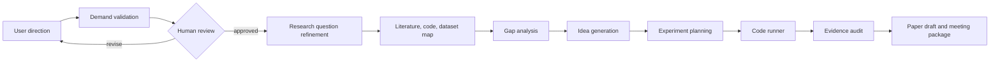

# NoviScope

[中文文档](README.zh-CN.md)

[Architecture](docs/architecture.md) · [Workflow](docs/workflow.md) ·
[Agent Contracts](docs/agent-contracts.md) · [Deployment](docs/deployment.md) ·
[Contributing](CONTRIBUTING.md) · [Collaboration Guide](docs/COLLABORATION.md) ·
[Source Policy](docs/source-policy.md) · [License](LICENSE)

Evidence-driven research workflow for turning vague research directions into verified
experiments and traceable paper drafts.

[](#development)
[](#api)
[](#current-status)

NoviScope is designed for computer-vision research groups that need to move from
an imprecise topic to a defensible research idea, experiment plan, evidence trail,
and paper draft. The long-term target is a digital research team that can search
papers, map existing work, propose novelty, reproduce baselines, run ablations,
audit claims, and produce paper and meeting materials with provenance.

This repository currently contains an admin-managed lab alpha: a FastAPI backend
plus a React web MVP for invitation-based group usage. It includes the first
executable research-workflow stages, but it does not yet implement GPU
experiment execution, baseline reproduction, Evidence Auditor execution, or PPT
generation.

## Why NoviScope

Many research ideas fail before the experiment stage because the demand is vague,
the application scenario is weak, or the proposed novelty is not grounded in
existing work. NoviScope is meant to make that loop explicit:

- Start from a short research direction, not a fully specified task.
- Verify whether the demand reflects a real scenario before experiments.
- Connect every idea to papers, datasets, code, assumptions, and risks.
- Keep experiment results traceable enough to feed into a paper draft.
- Let humans approve critical gates, especially demand validity and experiment claims.

Example directions:

- Handwritten text erasure for restoring used exam papers.
- AI + sports research, such as badminton trajectory recognition or action recognition.
- Other machine-vision tasks where novelty, baseline choice, and application value need
  early validation.

## Research Workflow


```mermaid
flowchart LR
    A["User direction"] --> B["Demand validation"]
    B --> C{"Human review"}
    C -->|approved| D["Research question refinement"]
    C -->|revise| A
    D --> E["Literature, code, dataset map"]
    E --> F["Gap analysis"]
    F --> G["Idea generation"]
    G --> H["Experiment planning"]
    H --> I["Code runner"]
    I --> J["Evidence audit"]
    J --> K["Paper draft and meeting package"]
```

The intended final output is not just text. NoviScope should produce a tracked
research package:

- demand validation report
- paper and baseline matrix
- gap and limitation map
- candidate ideas with falsifiable experiments
- lightweight feasibility results
- full experiment and ablation records
- evidence audit report
- English paper draft, Chinese paper draft, and Chinese meeting slides

## Agent Team

NoviScope models the research process as a 9-agent team. The current foundation
stores the agent contract registry and exposes it through the API.

| Agent | Goal | Key Outputs |
| --- | --- | --- |
| Demand Validator | Check whether the direction reflects a real application demand. | demand report, confidence, source risks |
| Research Refiner | Convert a broad direction into a scoped CV research question. | research brief, scope, keywords |
| Literature Scout | Build the paper, code, dataset, and baseline map. | bibliography matrix, taxonomy, baselines |
| Gap Analyst | Identify limitations and improvement space. | gap matrix, limitation map |
| Idea Generator | Generate evidence-linked hypotheses. | candidate ideas, idea risk table |
| Experiment Planner | Turn selected ideas into experiment and ablation plans. | experiment plan, metric plan |
| Code Runner | Run local reproduction, evaluation, and ablation jobs. | provenance, logs, metrics |
| Evidence Auditor | Audit source truth and claim-result alignment. | source audit, claim audit, blockers |
| Paper & Meeting Writer | Produce paper drafts and meeting materials. | English draft, Chinese draft, slides |

Only `code_runner` has the `run_code` permission in the registry.

## Current Status

Implemented lab alpha slice:

- FastAPI backend scaffold with SQLModel models for users, invitation codes,
  providers, quests, and stage cards.
- Invitation-code registration, session-cookie login/logout, and authenticated
  `/auth/me`.
- Admin invite creation through `/admin/invites`, with a bootstrap/test-only
  `X-NoviScope-Dev-Admin` path when explicitly enabled.
- Model gateway abstraction with encrypted provider configuration APIs and
  shared/personal provider scopes.
- Immutable 9-agent registry with deterministic API serialization.
- Quest ownership plus protected quest and stage APIs; members only access their
  own quests by default and admins can view all quests.
- Unified Stage Runner protocol and a runnable five-stage quest workflow:
  Demand Validation, Literature Scout, Gap & Hypothesis Generator, Experiment
  Planner, and Paper & Meeting Writer.
- Demand validation output with structured assessment, confidence, risks,
  missing evidence, human checklist, and raw-response retention.
- Literature Scout backed by OpenAlex metadata rather than model-invented
  citations.
- Evidence-linked hypothesis generation, idea selection gates, experiment setup
  notes, and experiment-plan generation.
- Review-only Markdown artifacts for Chinese/English research briefs, meeting
  outline, and IEEE-style paper skeleton with explicit no-results warnings.
- React + TypeScript + Vite + Tailwind web app in `web/` for registration, login,
  quest list/detail, quest creation, stage updates, stage output review, artifact
  downloads, and provider settings.
- Secret redaction and private outbound upload guard helpers.
- Test suite covering security, auth, models, agents, gateway, quests, and API
  behavior.
- GitHub issue templates, PR template, contributing guide, collaboration guide,
  and MIT license. GitHub Actions CI is tracked in issue #4 and is waiting for a
  token with `workflow` scope.

Not implemented yet:

- dedicated first-admin bootstrap CLI/route
- admin invite-management page in the web UI
- lab-wide per-agent default provider/model controls
- source adapters beyond OpenAlex, such as arXiv, Semantic Scholar, IEEE, ACM, or CVF
- demand-source crawling and poisoning-risk scoring
- GPU job scheduling on the lab A800 server
- baseline reproduction automation
- experiment artifact registry
- evidence auditor execution logic
- PPT generation

## Documentation Map

- [Architecture](docs/architecture.md): backend, frontend, data flow, state model,
  and trust boundaries.
- [Workflow](docs/workflow.md): how a quest moves through demand validation,
  literature scouting, idea generation, experiment planning, and writing.
- [Source Policy](docs/source-policy.md): evidence tiers, trusted venue policy,
  recency windows, poisoning rules, and claim-admission rules.
- [Agent Contracts](docs/agent-contracts.md): current executable stages,
  provider rules, output rules, and how to add a runner.
- [Deployment](docs/deployment.md): single-server lab deployment, bootstrap admin,
  provider configuration, and update flow.
- [Collaboration Guide](docs/COLLABORATION.md): team and AI-assisted contribution
  rules.

## Admin-Managed Lab Alpha

NoviScope is intended to be deployed once by a server administrator for a shared
lab URL. Group members then register with invitation codes, log in through the web
app, and use the same deployment for quests, stage review, and provider settings.

### Environment and backend

Copy the example environment file and edit it for your lab:

```bash
cp .env.example .env
```

Shared deployment should set:

- `NOVISCOPE_DATABASE_URL` to a PostgreSQL database
- `NOVISCOPE_PROVIDER_SECRET_KEY` to a long random secret for provider-key encryption
- `NOVISCOPE_SESSION_SECRET_KEY` to a different long random secret for session cookies
- `NOVISCOPE_SESSION_COOKIE_SECURE=true` when serving the app over HTTPS
- `NOVISCOPE_ARTIFACT_ROOT` to a persistent artifact directory
- `NOVISCOPE_DEV_ADMIN_HEADER_ENABLED=false` by default
- `NOVISCOPE_DEV_ADMIN_TOKEN` only when temporarily enabling the bootstrap header
- `NOVISCOPE_GITHUB_REPO=kopang0730/NoviScope` for admin update checks
- `NOVISCOPE_GITHUB_BRANCH=main` as the GitHub branch to compare against

If `NOVISCOPE_DATABASE_URL` is non-SQLite, NoviScope now refuses to start while
provider/session secrets are placeholders, too short, or low-entropy. If
`NOVISCOPE_DEV_ADMIN_HEADER_ENABLED=true`, `NOVISCOPE_DEV_ADMIN_TOKEN` must also
be a high-entropy token.

Development can still use SQLite:

```bash
NOVISCOPE_DATABASE_URL=sqlite:///./noviscope-dev.db \
NOVISCOPE_SESSION_COOKIE_SECURE=false \
uvicorn noviscope.main:app --reload
```

Lab deployment should use PostgreSQL:

```bash
uvicorn noviscope.main:app --host 127.0.0.1 --port 8000
```

### Bootstrap/test header

`POST /admin/invites` accepts `X-NoviScope-Dev-Admin` only when
`NOVISCOPE_DEV_ADMIN_HEADER_ENABLED=true`, the header value exactly matches
`NOVISCOPE_DEV_ADMIN_TOKEN`, and there is no authenticated admin session. Use
this header only for bootstrap/testing, not as a normal admin path.

The current alpha does not yet include a dedicated first-admin creation route. A
practical initial setup is:

1. Generate a one-time bootstrap token:
   ```bash
   python -c "import secrets; print(secrets.token_urlsafe(32))"
   ```
2. Temporarily set `NOVISCOPE_DEV_ADMIN_HEADER_ENABLED=true` and
   `NOVISCOPE_DEV_ADMIN_TOKEN=<generated-token>`.
3. Create a bootstrap invite with the dev header value set to the generated token.
4. Register the bootstrap account through `/auth/register`.
5. Promote that account to `admin` directly in PostgreSQL.
6. Log in as that admin, create ongoing invites/shared providers, then set
   `NOVISCOPE_DEV_ADMIN_HEADER_ENABLED=false` and restart the API.

Example promotion SQL:

```sql
UPDATE "user" SET role = 'admin' WHERE email = 'admin@example.com';
```

### Web app build and reverse proxy

For local frontend development:

```bash
cd web
npm install
npm run dev
```

The Vite dev server proxies `/api` to `http://127.0.0.1:8000`.

For deployment:

```bash
cd web
npm install
npm run build
```

Serve `web/dist` from your lab URL through Nginx or Caddy and proxy `/api/` to
the FastAPI backend. The shared deployment path should use HTTPS because session
cookies are secure by default:

```nginx
server {
  listen 80;
  server_name noviscope.example.internal;
  return 301 https://$host$request_uri;
}

server {
  listen 443 ssl;
  server_name noviscope.example.internal;

  ssl_certificate /etc/ssl/certs/noviscope.pem;
  ssl_certificate_key /etc/ssl/private/noviscope.key;

  location /api/ {
    proxy_pass http://127.0.0.1:8000/;
    proxy_set_header Host $host;
    proxy_set_header X-Forwarded-For $proxy_add_x_forwarded_for;
    proxy_set_header X-Forwarded-Proto $scheme;
  }

  location / {
    root /srv/noviscope/web/dist;
    try_files $uri /index.html;
  }
}
```

If you temporarily test on plain HTTP inside a trusted lab network, set
`NOVISCOPE_SESSION_COOKIE_SECURE=false`; do not use that setting for an exposed
shared deployment.

### Version notice and update builds

The web header shows the deployed NoviScope version under the brand mark.
Guests and members only see the public version number from `GET /version`. After
an admin logs in, the web app calls the read-only `GET /admin/version` endpoint
to compare the running commit against the configured GitHub branch and show an
update notice when the running commit is behind that branch.

The browser never executes server commands. A non-root server user can run the
local update/build script instead:

```bash
./scripts/update-and-build.sh
```

The script requires a clean worktree, checks `origin/main`, fast-forwards when an
update exists, reinstalls the editable backend package when `.venv/bin/python`
exists, and rebuilds `web/dist`. To run a restart command after a successful
build:

```bash
NOVISCOPE_RESTART_COMMAND='./restart-noviscope.sh' \
./scripts/update-and-build.sh
```

If the app is managed by tmux, systemd, Supervisor, or another runner, point
`NOVISCOPE_RESTART_COMMAND` at your own restart command or restart the service
manually after the script completes.

Once deployed, the normal lab flow is:

1. The server admin creates invitation codes and shared providers.
2. Group members open the lab URL and register with invitation codes.
3. Users log in and receive an HTTP-only session cookie.
4. Members create and review their own quests; admins can also manage shared
   provider configuration and additional invites.

## API

Run the service for local bootstrap smoke only:

```bash
NOVISCOPE_DEV_ADMIN_HEADER_ENABLED=true \
NOVISCOPE_DEV_ADMIN_TOKEN=local-dev-admin-token-0123456789abcdef \
NOVISCOPE_SESSION_COOKIE_SECURE=false \
uvicorn noviscope.main:app --reload
```

Use this only for local/bootstrap smoke. Shared deployments should keep the
deployment-safe defaults above.

Health check:

```bash
curl -s http://127.0.0.1:8000/health
```

List the built-in agent contracts:

```bash
curl -s http://127.0.0.1:8000/agents
```

Check the public deployment version:

```bash
curl -s http://127.0.0.1:8000/version
```

Check GitHub update status with an admin session:

```bash
curl -s -b cookies.txt http://127.0.0.1:8000/admin/version
```

Create a bootstrap invite for testing or initial setup only:

```bash
curl -s -X POST http://127.0.0.1:8000/admin/invites \
  -H "Content-Type: application/json" \
  -H "X-NoviScope-Dev-Admin: ${NOVISCOPE_DEV_ADMIN_TOKEN}" \
  -d '{"code":"BOOTSTRAP-INVITE","max_uses":1}'
```

Register a user with an invitation code:

```bash
curl -s -X POST http://127.0.0.1:8000/auth/register \
  -H "Content-Type: application/json" \
  -d '{
    "invite_code":"BOOTSTRAP-INVITE",
    "email":"member@example.com",
    "display_name":"Member",
    "password":"replace-with-a-password"
  }'
```

Log in and store the session cookie:

```bash
curl -i -c /tmp/noviscope-cookies.txt -s -X POST http://127.0.0.1:8000/auth/login \
  -H "Content-Type: application/json" \
  -d '{
    "email":"member@example.com",
    "password":"replace-with-a-password"
  }'
```

Check the authenticated session:

```bash
curl -s -b /tmp/noviscope-cookies.txt http://127.0.0.1:8000/auth/me
```

Create a personal provider as the logged-in member:

```bash
curl -s -b /tmp/noviscope-cookies.txt -X POST http://127.0.0.1:8000/providers \
  -H "Content-Type: application/json" \
  -d '{
    "name":"primary-openai",
    "kind":"openai_compatible",
    "base_url":"https://api.openai.com/v1",
    "default_model":"gpt-4.1",
    "api_key":"example-provider-key",
    "scope":"personal"
  }'
```

Provider responses never include the raw API key or encrypted key. For shared
deployment, set `NOVISCOPE_PROVIDER_SECRET_KEY` before storing real keys.

Create a research quest as an authenticated user:

```bash
curl -s -b /tmp/noviscope-cookies.txt -X POST http://127.0.0.1:8000/quests \
  -H "Content-Type: application/json" \
  -d '{"title":"AI+Sports Badminton","initial_direction":"AI+体育，羽毛球"}'
```

The response includes a `draft` quest and a first stage assigned to
`demand_validator`.

Update a stage after manual review:

```bash
curl -s -b /tmp/noviscope-cookies.txt -X PATCH http://127.0.0.1:8000/stages/<stage_id> \
  -H "Content-Type: application/json" \
  -d '{
    "status":"complete",
    "summary":"Demand has concrete education scenario evidence.",
    "output_payload":{"confidence":0.82},
    "evidence_payload":{"sources":["enterprise-demand-note"]},
    "human_approved":true,
    "review_notes":"Proceed to idea generation."
  }'
```

## Development

Install dependencies:

```bash
python -m venv .venv
source .venv/bin/activate
pip install -e ".[dev]"
cd web && npm install
```

Run tests:

```bash
python -m pytest
```

Run lint:

```bash
python -m ruff check .
```

Run API locally:

```bash
NOVISCOPE_SESSION_COOKIE_SECURE=false \
uvicorn noviscope.main:app --reload
```

Use a custom SQLite database path:

```bash
NOVISCOPE_DATABASE_URL=sqlite:///./noviscope.db \
NOVISCOPE_SESSION_COOKIE_SECURE=false \
uvicorn noviscope.main:app --reload
```

Run the web app locally:

```bash
cd web
npm run dev
```

Build the web app:

```bash
cd web
npm run build
```

## Repository Layout

```text
src/noviscope/
  agents/          Built-in research-agent contracts.
  api/             FastAPI routes and response schemas.
  core/            Settings, secret redaction, outbound data safety.
  db/              Database engine, schema, and session helpers.
  model_gateway/   Provider profile and adapter abstraction.
  models/          SQLModel domain models.
  quests/          Research quest workflow service.
tests/             Unit and API tests.
web/               React + TypeScript + Vite lab web app.
docs/superpowers/  Design specs and implementation plans.
```

## Safety Model

NoviScope is being designed for research workflows where trust matters more than
volume. The foundation already includes the following safety constraints:

- API keys are represented with redaction-aware types in the gateway profile.
- Provider API keys are encrypted before storage and excluded from API responses.
- `.env`, SQLite databases, virtual environments, and local tool caches are ignored.
- Private code, datasets, logs, checkpoints, and unpublished drafts are modeled as
  protected outbound data classes.
- Private outbound upload requires explicit user approval.
- Experiment-capable permissions are isolated to the `code_runner` agent contract.

Future versions should extend this into a full evidence and provenance layer:

- source reliability scoring
- cross-reference checks for paper claims
- experiment-result provenance
- claim-to-metric alignment
- human approval gates before paper conclusions are generated

## Roadmap

Near-term:

- Dedicated first-admin bootstrap CLI or deployment command.
- Admin invite-management UI in the web app.
- Agent assignment and admin lab settings UI.
- Literature retrieval module with venue/year/source filters.
- Demand validation workflow with trusted source allowlists.
- Research quest audit logs and provider connection smoke tests.
- Enable GitHub Actions CI after granting `workflow` scope to the publishing token.

Mid-term:

- Baseline/code/dataset discovery.
- Experiment runner for local lab servers.
- Lightweight feasibility experiment loop.
- Result ingestion and evidence audit reports.
- Paper outline and meeting-report generation.

Long-term:

- Full machine-vision research workflow from broad direction to reproducible paper package.
- Human-in-the-loop gatekeeping for demand validity, novelty, and paper conclusions.
- Lab-server deployment with GPU job isolation and private-data controls.

## Design References

The README structure is inspired by the way
[DeepScientist](https://github.com/ResearAI/DeepScientist) presents a research-agent
system: clear positioning, workflow, capabilities, quick start, and roadmap. NoviScope
does not copy DeepScientist content or implementation; it adapts that documentation
style to a computer-vision lab workflow with demand validation, provenance, and
human review gates.
