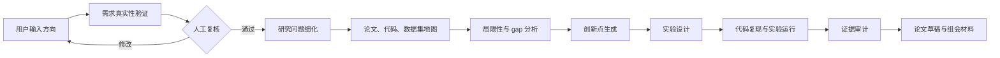

# NoviScope

[English](README.md)

面向机器视觉科研小组的证据驱动型数字科研工作流：把模糊研究方向转化为可验证实验、可追踪证据链和论文草稿。

[](#开发)
[](#api)
[](#当前状态)

NoviScope 的目标用户是需要从一个不够明确的研究想法出发，逐步形成可信选题、实验设计、结果解释和论文表达的机器视觉科研团队。长期目标是搭建一个数字科研团队：它可以检索论文、梳理已有工作、提出创新点、复现 baseline、运行消融实验、审计结论，并最终生成论文和组会材料。

当前仓库实现的是第一阶段后端基础切片。它还没有实现完整的文献检索、GPU 实验执行、论文生成或 PPT 生成。

## 为什么做 NoviScope

很多科研想法不是失败在训练阶段，而是更早失败在选题阶段：需求不真实、应用场景站不住、创新点没有建立在已有工作之上，或者实验结论无法追溯。NoviScope 想把这个过程显式化：

- 用户只需要输入一个简短方向，而不是完整课题定义。
- 在进入实验前先验证需求是否来自真实场景。
- 让每个 idea 都能关联到论文、数据集、代码、假设和风险。
- 让实验结果有足够 provenance，可以回填到论文草稿。
- 在关键节点保留人工复核，尤其是需求真实性和实验结论。

示例方向：

- 手写文本擦除：把已填写试卷恢复成干净试卷。
- AI + 体育：例如羽毛球轨迹识别、羽毛球动作识别。
- 其他需要验证创新空间、baseline 和落地价值的机器视觉任务。

## 科研工作流



NoviScope 最终产出的不应该只是几段文字，而是一套可追踪的科研包：

- 需求验证报告
- 论文和 baseline 矩阵
- gap 和局限性地图
- 带可证伪实验的候选 idea
- 轻量可行性实验结果
- 完整实验和消融实验记录
- 证据审计报告
- 英文论文草稿、中文论文草稿和中文组会材料

## 智能体团队

NoviScope 把科研流程拆成 9 个智能体。当前基础版本已经实现了智能体契约注册表，并通过 API 暴露。

| 智能体 | 目标 | 关键输出 |
| --- | --- | --- |
| Demand Validator | 判断方向是否对应真实应用需求。 | 需求报告、置信度、来源风险 |
| Research Refiner | 把宽泛方向收敛成机器视觉研究问题。 | 研究简报、范围、关键词 |
| Literature Scout | 构建论文、代码、数据集和 baseline 地图。 | 文献矩阵、方法分类、baseline 候选 |
| Gap Analyst | 找出现有工作的局限和改进空间。 | gap 矩阵、局限性地图 |
| Idea Generator | 生成有证据支撑的研究假设。 | 候选 idea、idea 风险表 |
| Experiment Planner | 把选中的 idea 转化为实验和消融计划。 | 实验计划、指标计划 |
| Code Runner | 执行本地复现、评估和消融实验。 | 实验 provenance、日志、指标 |
| Evidence Auditor | 审计来源真实性和结论-结果一致性。 | 来源审计、结论审计、阻塞问题 |
| Paper & Meeting Writer | 生成论文草稿和组会材料。 | 英文草稿、中文草稿、PPT |

当前注册表中，只有 `code_runner` 拥有 `run_code` 权限。

## 当前状态

已经实现的 foundation slice：

- FastAPI 后端脚手架。
- SQLModel 领域模型：provider、agent assignment、quest、stage card。
- SQLite 数据库设置，并启用外键约束。
- Model Gateway 抽象：provider profile、adapter 注册和连接测试。
- 不可变的 9-agent registry，并保证 API 序列化顺序稳定。
- Quest service：创建 quest 时自动生成第一个 `demand_validator` stage。
- HTTP API：健康检查、agent 列表、quest 创建。
- 密钥脱敏和私有数据外发保护 helper。
- 测试覆盖 security、models、agents、gateway、quests 和 API 行为。

还没有实现：

- arXiv、Semantic Scholar、Google Scholar、IEEE、ACM、CVF 等真实文献检索。
- 需求来源抓取和投毒风险评分。
- 实验室 A800 服务器上的 GPU job 调度。
- baseline 自动复现。
- 实验产物注册表。
- Evidence Auditor 的实际执行逻辑。
- 论文和 PPT 生成。
- Web 前端。

## API

启动服务：

```bash
uvicorn noviscope.main:app --reload
```

健康检查：

```bash
curl -s http://127.0.0.1:8000/health
```

查看内置智能体契约：

```bash
curl -s http://127.0.0.1:8000/agents
```

创建科研 quest：

```bash
curl -s -X POST http://127.0.0.1:8000/quests \
  -H "Content-Type: application/json" \
  -d '{"title":"AI+Sports Badminton","initial_direction":"AI+体育，羽毛球"}'
```

返回结果会包含一个 `draft` 状态的 quest，以及一个分配给 `demand_validator` 的 first stage。

## 开发

安装依赖：

```bash
python -m venv .venv
source .venv/bin/activate
pip install -e ".[dev]"
```

运行测试：

```bash
pytest
```

运行 lint：

```bash
ruff check .
```

本地启动 API：

```bash
uvicorn noviscope.main:app --reload
```

指定 SQLite 数据库路径：

```bash
NOVISCOPE_DATABASE_URL=sqlite:///./noviscope.db uvicorn noviscope.main:app --reload
```

## 仓库结构

```text
src/noviscope/
  agents/          内置科研智能体契约。
  api/             FastAPI 路由和响应 schema。
  core/            设置、密钥脱敏、外发数据安全。
  db/              数据库 engine、schema 和 session helper。
  model_gateway/   模型 provider profile 和 adapter 抽象。
  models/          SQLModel 领域模型。
  quests/          科研 quest 工作流服务。
tests/             单元测试和 API 测试。
docs/superpowers/  设计文档和实现计划。
```

## 安全模型

NoviScope 面向科研工作流，可信度比生成数量更重要。当前基础版本已经包含以下安全约束：

- Model Gateway 中的 API key 使用具备脱敏语义的类型。
- `.env`、SQLite 数据库、虚拟环境和本地工具缓存不会进入 git。
- 私有代码、数据集、实验日志、checkpoint 和未发表草稿被建模为受保护的外发数据类型。
- 私有数据外发需要明确的用户批准。
- 实验执行权限只分配给 `code_runner` 智能体契约。

后续版本应该进一步扩展为完整证据和 provenance 层：

- 来源可信度评分
- 论文 claim 的交叉引用检查
- 实验结果 provenance
- claim 与 metric 的一致性检查
- 论文结论生成前的人工审批门

## Roadmap

近期：

- 带 venue、年份和来源过滤的文献检索模块。
- 使用可信来源 allowlist 的需求验证工作流。
- Provider 配置 UI/API，支持 OpenAI-compatible、Anthropic、DeepSeek、Kimi、MiniMax、GLM 等模型端点。
- Research quest 阶段流转和审计日志。
- 用于输入方向和查看 stage card 的最小 Web 界面。

中期：

- baseline、代码和数据集发现。
- 面向本地实验室服务器的实验 runner。
- 轻量可行性实验循环。
- 结果导入和证据审计报告。
- 论文大纲和组会报告生成。

长期：

- 从宽泛方向到可复现实验论文包的完整机器视觉科研工作流。
- 面向需求真实性、创新性和论文结论的人机协同 gatekeeping。
- 面向实验室服务器部署的 GPU job 隔离和私有数据控制。

## 设计参考

README 的组织方式参考了 [DeepScientist](https://github.com/ResearAI/DeepScientist)：先讲定位、工作流、能力边界、快速开始和路线图。NoviScope 没有复制 DeepScientist 的内容或实现，而是把这种文档结构适配到机器视觉课题组的科研流程，重点放在需求验证、证据链和人工复核门。
