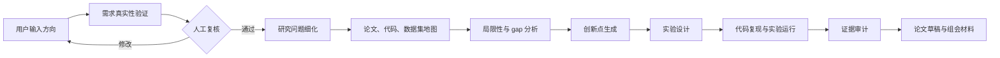

# NoviScope

[English](README.md)

[贡献指南](CONTRIBUTING.md) · [协作规范](docs/COLLABORATION.md) · [许可证](LICENSE)

面向机器视觉科研小组的证据驱动型数字科研工作流：把模糊研究方向转化为可验证实验、可追踪证据链和论文草稿。

[](#开发)
[](#api)
[](#当前状态)

NoviScope 的目标用户是需要从一个不够明确的研究想法出发，逐步形成可信选题、实验设计、结果解释和论文表达的机器视觉科研团队。长期目标是搭建一个数字科研团队：它可以检索论文、梳理已有工作、提出创新点、复现 baseline、运行消融实验、审计结论，并最终生成论文和组会材料。

当前仓库实现的是第一版面向课题组共享部署的 Lab Alpha：包含 FastAPI 后端和 React Web MVP。它还没有实现完整的文献检索、GPU 实验执行、论文生成或 PPT 生成。

## 为什么做 NoviScope

很多科研想法不是失败在训练阶段，而是更早失败在选题阶段：需求不真实、应用场景站不住、创新点没有建立在已有工作之上，或者实验结论无法追溯。NoviScope 想把这个过程显式化：

- 用户只需要输入一个简短方向，而不是完整课题定义。
- 在进入实验前先验证需求是否来自真实场景。
- 让每个 idea 都能关联到论文、数据集、代码、假设和风险。
- 让实验结果有足够 provenance，可以回填到论文草稿。
- 在关键节点保留人工复核，尤其是需求真实性和实验结论。

示例方向：

- 手写文本擦除：把已填写试卷恢复成干净试卷。
- AI + 体育：例如羽毛球轨迹识别、羽毛球动作识别。
- 其他需要验证创新空间、baseline 和落地价值的机器视觉任务。

## 科研工作流


```mermaid
flowchart LR
    A["用户输入方向"] --> B["需求真实性验证"]
    B --> C{"人工复核"}
    C -->|通过| D["研究问题细化"]
    C -->|修改| A
    D --> E["论文、代码、数据集地图"]
    E --> F["局限性与 gap 分析"]
    F --> G["创新点生成"]
    G --> H["实验设计"]
    H --> I["代码复现与实验运行"]
    I --> J["证据审计"]
    J --> K["论文草稿与组会材料"]
```

NoviScope 最终产出的不应该只是几段文字，而是一套可追踪的科研包：

- 需求验证报告
- 论文和 baseline 矩阵
- gap 和局限性地图
- 带可证伪实验的候选 idea
- 轻量可行性实验结果
- 完整实验和消融实验记录
- 证据审计报告
- 英文论文草稿、中文论文草稿和中文组会材料

## 智能体团队

NoviScope 把科研流程拆成 9 个智能体。当前基础版本已经实现了智能体契约注册表，并通过 API 暴露。

| 智能体 | 目标 | 关键输出 |
| --- | --- | --- |
| Demand Validator | 判断方向是否对应真实应用需求。 | 需求报告、置信度、来源风险 |
| Research Refiner | 把宽泛方向收敛成机器视觉研究问题。 | 研究简报、范围、关键词 |
| Literature Scout | 构建论文、代码、数据集和 baseline 地图。 | 文献矩阵、方法分类、baseline 候选 |
| Gap Analyst | 找出现有工作的局限和改进空间。 | gap 矩阵、局限性地图 |
| Idea Generator | 生成有证据支撑的研究假设。 | 候选 idea、idea 风险表 |
| Experiment Planner | 把选中的 idea 转化为实验和消融计划。 | 实验计划、指标计划 |
| Code Runner | 执行本地复现、评估和消融实验。 | 实验 provenance、日志、指标 |
| Evidence Auditor | 审计来源真实性和结论-结果一致性。 | 来源审计、结论审计、阻塞问题 |
| Paper & Meeting Writer | 生成论文草稿和组会材料。 | 英文草稿、中文草稿、PPT |

当前注册表中，只有 `code_runner` 拥有 `run_code` 权限。

## 当前状态

已经实现的 Lab Alpha：

- FastAPI 后端脚手架，以及 user、invite code、provider、quest、stage card 等 SQLModel 领域模型。
- 基于邀请码的注册、session cookie 登录/登出，以及受保护的 `/auth/me`。
- 通过 `/admin/invites` 创建邀请码；在显式开启时也保留仅供 bootstrap/测试使用的 `X-NoviScope-Dev-Admin` 路径。
- Model Gateway 抽象，以及带 API key 加密存储的 provider 配置 API，支持 shared/personal 两种 scope。
- 不可变的 9-agent registry，并保证 API 序列化顺序稳定。
- Quest ownership 与受保护的 quest/stage API；member 默认只能访问自己的 quest，admin 可以查看所有 quest。
- 位于 `web/` 的 React + TypeScript + Vite + Tailwind Web 应用，已经支持注册、登录、quest 列表与详情、quest 创建、stage 更新和 provider 设置。
- 密钥脱敏和私有数据外发保护 helper。
- 测试覆盖 security、auth、models、agents、gateway、quests 和 API 行为。
- GitHub issue 模板、PR 模板、贡献指南、协作规范和 MIT license。GitHub Actions CI 已在 issue #4 跟踪，等待具备 `workflow` scope 的 token 后启用。

还没有实现：

- 专门的首个 admin bootstrap CLI/route
- Web 端的 admin 邀请码管理页面
- agent assignment UI
- arXiv、Semantic Scholar、Google Scholar、IEEE、ACM、CVF 等真实文献检索。
- 需求来源抓取和投毒风险评分。
- 实验室 A800 服务器上的 GPU job 调度。
- baseline 自动复现。
- 实验产物注册表。
- Evidence Auditor 的实际执行逻辑。
- 论文和 PPT 生成。

## 面向课题组共享部署的 Lab Alpha

NoviScope 的目标是由服务器管理员部署一次，作为课题组统一入口。组内成员随后通过实验室 URL 打开 Web 应用，使用邀请码注册并登录，在同一套服务上创建 quest、查看 stage、管理自己的 provider。

### 环境变量与后端启动

先复制环境变量示例文件：

```bash
cp .env.example .env
```

共享部署时至少需要配置：

- `NOVISCOPE_DATABASE_URL`：指向 PostgreSQL
- `NOVISCOPE_PROVIDER_SECRET_KEY`：用于 provider key 加密的长随机密钥
- `NOVISCOPE_SESSION_SECRET_KEY`：与上面不同、用于 session cookie 的长随机密钥
- `NOVISCOPE_ARTIFACT_ROOT`：持久化 artifact 目录
- `NOVISCOPE_DEV_ADMIN_HEADER_ENABLED=false`：共享部署默认应关闭

开发环境仍然可以继续使用 SQLite：

```bash
NOVISCOPE_DATABASE_URL=sqlite:///./noviscope-dev.db uvicorn noviscope.main:app --reload
```

实验室部署应使用 PostgreSQL：

```bash
uvicorn noviscope.main:app --host 127.0.0.1 --port 8000
```

### bootstrap/测试专用请求头

只有在 `NOVISCOPE_DEV_ADMIN_HEADER_ENABLED=true` 且当前没有已登录 admin session 时，`POST /admin/invites` 才接受 `X-NoviScope-Dev-Admin: true`。这个请求头只应用于 bootstrap 或测试，不应作为共享部署中的常规管理方式。

当前 alpha 还没有独立的“首个 admin 创建”路由。比较现实的初始化方式是：

1. 临时把 `NOVISCOPE_DEV_ADMIN_HEADER_ENABLED` 设为 `true`。
2. 用 dev admin header 创建一个 bootstrap invite。
3. 通过 `/auth/register` 注册 bootstrap 账号。
4. 直接在 PostgreSQL 中把这个账号提升为 `admin`。
5. 以该 admin 身份登录，继续创建正式邀请码和 shared provider，然后把 `NOVISCOPE_DEV_ADMIN_HEADER_ENABLED` 改回 `false` 并重启 API。

示例 SQL：

```sql
UPDATE "user" SET role = 'admin' WHERE email = 'admin@example.com';
```

### Web 构建与反向代理

本地开发 Web：

```bash
cd web
npm install
npm run dev
```

Vite 开发服务器会把 `/api` 代理到 `http://127.0.0.1:8000`。

部署构建：

```bash
cd web
npm install
npm run build
```

将 `web/dist` 通过 Nginx 或 Caddy 挂到实验室 URL，并把 `/api/` 反向代理到 FastAPI：

```nginx
server {
  listen 80;
  server_name noviscope.example.internal;

  location /api/ {
    proxy_pass http://127.0.0.1:8000/;
    proxy_set_header Host $host;
    proxy_set_header X-Forwarded-For $proxy_add_x_forwarded_for;
    proxy_set_header X-Forwarded-Proto $scheme;
  }

  location / {
    root /srv/noviscope/web/dist;
    try_files $uri /index.html;
  }
}
```

部署完成后的正常使用流程：

1. 服务器管理员创建邀请码和 shared provider。
2. 组成员打开实验室 URL，用邀请码注册。
3. 用户登录后获得 HTTP-only session cookie。
4. member 创建并审阅自己的 quest；admin 还可以管理 shared provider 和后续邀请码。

## API

启动服务：

```bash
uvicorn noviscope.main:app --reload
```

健康检查：

```bash
curl -s http://127.0.0.1:8000/health
```

查看内置智能体契约：

```bash
curl -s http://127.0.0.1:8000/agents
```

仅用于测试或初始化的 bootstrap invite 创建：

```bash
curl -s -X POST http://127.0.0.1:8000/admin/invites \
  -H "Content-Type: application/json" \
  -H "X-NoviScope-Dev-Admin: true" \
  -d '{"code":"BOOTSTRAP-INVITE","max_uses":1}'
```

使用邀请码注册用户：

```bash
curl -s -X POST http://127.0.0.1:8000/auth/register \
  -H "Content-Type: application/json" \
  -d '{
    "invite_code":"BOOTSTRAP-INVITE",
    "email":"member@example.com",
    "display_name":"Member",
    "password":"replace-with-a-password"
  }'
```

登录并保存 session cookie：

```bash
curl -i -c /tmp/noviscope-cookies.txt -s -X POST http://127.0.0.1:8000/auth/login \
  -H "Content-Type: application/json" \
  -d '{
    "email":"member@example.com",
    "password":"replace-with-a-password"
  }'
```

检查当前已认证用户：

```bash
curl -s -b /tmp/noviscope-cookies.txt http://127.0.0.1:8000/auth/me
```

以已登录 member 身份创建 personal provider：

```bash
curl -s -b /tmp/noviscope-cookies.txt -X POST http://127.0.0.1:8000/providers \
  -H "Content-Type: application/json" \
  -d '{
    "name":"primary-openai",
    "kind":"openai_compatible",
    "base_url":"https://api.openai.com/v1",
    "default_model":"gpt-4.1",
    "api_key":"example-provider-key",
    "scope":"personal"
  }'
```

Provider API 响应不会返回原始 API key 或密文。共享部署保存真实 key 前，应先设置 `NOVISCOPE_PROVIDER_SECRET_KEY`。

以已登录用户身份创建科研 quest：

```bash
curl -s -b /tmp/noviscope-cookies.txt -X POST http://127.0.0.1:8000/quests \
  -H "Content-Type: application/json" \
  -d '{"title":"AI+Sports Badminton","initial_direction":"AI+体育，羽毛球"}'
```

返回结果会包含一个 `draft` 状态的 quest，以及一个分配给 `demand_validator` 的 first stage。

人工复核后更新 stage：

```bash
curl -s -b /tmp/noviscope-cookies.txt -X PATCH http://127.0.0.1:8000/stages/<stage_id> \
  -H "Content-Type: application/json" \
  -d '{
    "status":"complete",
    "summary":"Demand has concrete education scenario evidence.",
    "output_payload":{"confidence":0.82},
    "evidence_payload":{"sources":["enterprise-demand-note"]},
    "human_approved":true,
    "review_notes":"Proceed to idea generation."
  }'
```

## 开发

安装依赖：

```bash
python -m venv .venv
source .venv/bin/activate
pip install -e ".[dev]"
cd web && npm install
```

运行测试：

```bash
python -m pytest
```

运行 lint：

```bash
python -m ruff check .
```

本地启动 API：

```bash
uvicorn noviscope.main:app --reload
```

指定 SQLite 数据库路径：

```bash
NOVISCOPE_DATABASE_URL=sqlite:///./noviscope.db uvicorn noviscope.main:app --reload
```

本地启动 Web：

```bash
cd web
npm run dev
```

构建 Web：

```bash
cd web
npm run build
```

## 仓库结构

```text
src/noviscope/
  agents/          内置科研智能体契约。
  api/             FastAPI 路由和响应 schema。
  core/            设置、密钥脱敏、外发数据安全。
  db/              数据库 engine、schema 和 session helper。
  model_gateway/   模型 provider profile 和 adapter 抽象。
  models/          SQLModel 领域模型。
  quests/          科研 quest 工作流服务。
tests/             单元测试和 API 测试。
web/               React + TypeScript + Vite 实验室 Web 应用。
docs/superpowers/  设计文档和实现计划。
```

## 安全模型

NoviScope 面向科研工作流，可信度比生成数量更重要。当前基础版本已经包含以下安全约束：

- Model Gateway 中的 API key 使用具备脱敏语义的类型。
- Provider API key 会先加密再存储，并且不会出现在 API 响应中。
- `.env`、SQLite 数据库、虚拟环境和本地工具缓存不会进入 git。
- 私有代码、数据集、实验日志、checkpoint 和未发表草稿被建模为受保护的外发数据类型。
- 私有数据外发需要明确的用户批准。
- 实验执行权限只分配给 `code_runner` 智能体契约。

后续版本应该进一步扩展为完整证据和 provenance 层：

- 来源可信度评分
- 论文 claim 的交叉引用检查
- 实验结果 provenance
- claim 与 metric 的一致性检查
- 论文结论生成前的人工审批门

## Roadmap

近期：

- 专门的首个 admin bootstrap CLI 或部署命令。
- Web 端的 admin 邀请码管理页面。
- agent assignment 与实验室管理设置 UI。
- 带 venue、年份和来源过滤的文献检索模块。
- 使用可信来源 allowlist 的需求验证工作流。
- Research quest 审计日志与 provider 连接烟雾测试。
- 在发布 token 获得 `workflow` scope 后启用 GitHub Actions CI。

中期：

- baseline、代码和数据集发现。
- 面向本地实验室服务器的实验 runner。
- 轻量可行性实验循环。
- 结果导入和证据审计报告。
- 论文大纲和组会报告生成。

长期：

- 从宽泛方向到可复现实验论文包的完整机器视觉科研工作流。
- 面向需求真实性、创新性和论文结论的人机协同 gatekeeping。
- 面向实验室服务器部署的 GPU job 隔离和私有数据控制。

## 设计参考

README 的组织方式参考了 [DeepScientist](https://github.com/ResearAI/DeepScientist)：先讲定位、工作流、能力边界、快速开始和路线图。NoviScope 没有复制 DeepScientist 的内容或实现，而是把这种文档结构适配到机器视觉课题组的科研流程，重点放在需求验证、证据链和人工复核门。
