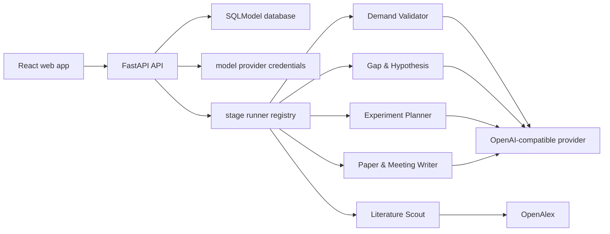

# NoviScope Architecture

This document describes the current Web MVP architecture. It is intentionally
written as an implementation boundary: if a capability is not listed as
implemented, contributors should treat it as planned work rather than existing
behavior.

## System Shape

The deployed system has two surfaces:

- Backend: `src/noviscope`, served by `noviscope.main:app`.
- Web app: `web/`, a React + Vite + TypeScript application that talks to the
  backend through `/api` in development and deployment.

The current MVP is a single-process FastAPI service. It does not include a job
queue, GPU scheduler, artifact registry, or background worker yet.

## Backend Modules

`src/noviscope/models`

SQLModel domain tables for users, invitation codes, providers, quests, stages,
and agent assignment data. `Quest` owns the broad research direction. `StageCard`
stores every workflow-stage payload and review state.

`src/noviscope/auth`

Invitation-code registration, password hashing, session cookie handling, and
role checks. The shared deployment model assumes one server administrator creates
invites and shared providers for group members.

`src/noviscope/providers`

Provider CRUD and encrypted API-key storage. API responses expose provider
metadata but never expose raw keys or encrypted key material.

`src/noviscope/agents`

Agent registry, shared `StageRunner` protocol, and current stage-runner
implementations. Runners return structured `StageRunResult` values containing
`input_payload`, `output_payload`, `evidence_payload`, `summary`, and
`confidence`.

`src/noviscope/api`

FastAPI route modules. `routes.py` owns auth, providers, agents, quests, and
manual stage updates. `stage_runs.py` owns executable stage transitions and
dependency gates.

`src/noviscope/quests`

Quest creation, ownership filtering, stage listing, stage updates, allowed state
transitions, and quest-status synchronization.

## Frontend Modules

`web/src/pages`

Route-level screens for registration, login, quest creation, quest list/detail,
provider settings, and stage detail.

`web/src/components`

Reusable cards, tables, forms, workflow panels, stage output renderers, and
agent-specific output views. Raw JSON is available for inspection but the main
stage views should prefer structured cards and tables.

`web/src/i18n`

The bilingual string table. Any new route or major component must add both
English and Chinese strings in the same change.

`web/src/lib`

Frontend interpretation helpers for stage status, output shaping, provider
forms, and overview cards.

## Core Data Flow

1. A user registers with an invite and logs in.
2. The user creates a quest from a structured intake form.
3. `QuestService.create_quest` creates five stage cards:
   `demand_validator`, `literature_scout`, `idea_generator`,
   `experiment_planner`, and `paper_meeting_writer`.
4. The web app displays the quest, stage timeline, and stage detail views.
5. A runnable stage calls `POST /stages/{stage_id}/run`.
6. `stage_runs.py` checks:
   - whether the stage has a runner;
   - whether prerequisites are complete;
   - whether a provider is needed and available;
   - whether the provider kind is supported.
7. The runner writes structured payloads back to the stage card.
8. Human review fields remain explicit through `human_approved` and
   `review_notes`.

## Stage State Model

Current stage statuses:

- `pending`: created but not run yet.
- `running`: reserved for execution in progress.
- `blocked`: cannot proceed until configuration, prerequisites, or input data are
  fixed.
- `complete`: runner or manual reviewer wrote final output for that stage.

Allowed transitions are intentionally narrow:

- `pending -> running | blocked`
- `running -> complete | blocked`
- `blocked -> pending | running`
- `complete` is terminal in the current MVP

The terminal `complete` rule prevents accidental overwrites of completed research
evidence. Future rerun support should create an explicit versioned-run model
instead of mutating completed output in place.

## Trust Boundaries

Provider API keys:

- accepted only through provider APIs and forms;
- encrypted before storage;
- excluded from provider responses;
- never required for `Literature Scout`, which currently uses OpenAlex metadata.

Research claims:

- model outputs must keep raw responses in payloads for audit;
- UI should surface structured claims, confidence, warnings, and review gates;
- no stage may claim that experiments have run unless execution provenance exists.

Private data:

- private datasets, code, logs, checkpoints, and unpublished drafts must not be
  committed to git;
- experiment execution and private upload flows are planned, not implemented.

## Implemented vs Planned

Implemented now:

- invite-based authentication and roles;
- quest creation and ownership;
- provider configuration with encrypted keys;
- five-stage workflow creation;
- demand validation through an OpenAI-compatible/custom provider;
- literature scouting through OpenAlex;
- evidence-linked idea generation through a model provider;
- experiment planning through a model provider;
- paper/meeting Markdown artifact generation through a model provider;
- structured web views for the core stage outputs.

Planned:

- admin invite-management UI;
- lab-wide per-agent default provider/model controls;
- dedicated first-admin bootstrap command;
- versioned stage reruns and artifact storage;
- baseline reproduction and GPU job scheduling;
- evidence auditor execution;
- PPT generation.
