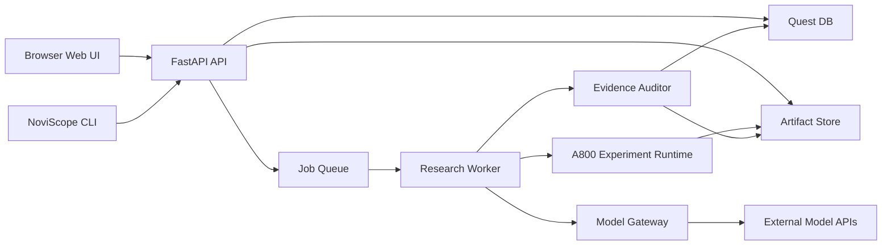

# NoviScope User Entry and Deployment Design

Date: 2026-06-30  
Status: user-approved design draft  
Scope: product entry, deployment topology, and first web experience  

## 1. Decision

NoviScope should use a Web interface as the primary user entry and keep a CLI as an
operations and developer entry. It should not be positioned as a pure agentcode or
terminal-only tool.

The first deployment target is a Linux GPU server in the research group. Users access
the web UI from their own computers through SSH port forwarding during the MVP phase.
After the workflow is stable, the deployment can move to an internal domain behind
Nginx or Caddy with authentication.

## 2. Why Web First

NoviScope's core value is not command execution. Its value is making the research
process reviewable:

- which quest is running
- which stage needs human approval
- which papers, sources, datasets, and repos support an idea
- which experiment produced which metric
- which claim is supported, contradicted, or still weak
- which content is safe to write into a paper or meeting deck

These are dashboard, review, and provenance problems. A web interface can make them
visible to both students and supervisors. A terminal interface is still useful, but
mostly for installation, service startup, health checks, worker management, and
debugging.

## 3. Entry Surfaces

### 3.1 Web App

Primary users open a browser and work through the web app.

Expected first screens:

1. Provider setup: configure OpenAI-compatible, Anthropic, DeepSeek, Kimi, MiniMax,
   GLM, MIMO, or custom endpoints.
2. Quest creation: enter a research direction, target language, compute budget, and
   optional scenario clues.
3. Quest board: inspect current stage, next action, risk flags, and pending human
   reviews.
4. Stage detail: read generated reports, evidence tables, logs, artifacts, and agent
   decisions.
5. Human review cards: approve, revise, reject, or add constraints before expensive
   stages proceed.
6. Artifact viewer: preview paper drafts, meeting report, figures, and exported files.

### 3.2 CLI

The CLI is not the main research experience. It is the control plane for deployment
and maintenance.

Recommended commands:

```bash
noviscope doctor
noviscope init
noviscope serve --host 127.0.0.1 --port 8000
noviscope worker
noviscope migrate
noviscope export quest <quest-id>
```

The CLI can also support advanced users who want scripting, but the MVP should not
require ordinary users to understand task queues, databases, or worker processes.

### 3.3 Agentcode Compatibility

NoviScope can later expose an agentcode-style interface for Codex, Claude Code, or
OpenClaw-style tools. This should be a secondary integration surface:

```text
agent tool -> NoviScope API -> quest/stage/evidence records
```

Agentcode should not bypass the NoviScope state machine, evidence auditor, or human
review gates.

## 4. MVP Deployment

### 4.1 Single-Server SSH Tunnel Mode

This is the recommended MVP deployment.

```text
User laptop browser
  -> SSH local port forwarding
  -> Linux A800 server localhost
  -> NoviScope FastAPI + Web UI
  -> SQLite/PostgreSQL
  -> local worker process
  -> GPU experiment environment
  -> external model APIs
```

Server command:

```bash
noviscope serve --host 127.0.0.1 --port 8000
```

User laptop command:

```bash
ssh -L 8000:127.0.0.1:8000 username@server-ip
```

Browser URL:

```text
http://127.0.0.1:8000
```

This mode has three benefits:

- no public port exposure
- no HTTPS/domain setup required for early testing
- private server resources remain behind SSH authentication

### 4.2 Lab Internal Mode

After several users start using NoviScope, the server should expose an internal web
entry through a reverse proxy:

```text
https://noviscope.lab.local
  -> Nginx/Caddy
  -> NoviScope backend
  -> Web static assets
  -> worker queue
  -> database
  -> artifact storage
```

This mode requires:

- login authentication
- HTTPS or trusted internal TLS
- user roles
- per-user provider credentials or shared lab provider profiles
- storage quotas and cleanup policy
- GPU job concurrency limits

### 4.3 Docker Compose Mode

The long-term deployment should support a one-command lab install:

```text
docker compose up -d
```

Planned services:

- `web`: frontend static server or bundled FastAPI static assets
- `api`: FastAPI backend
- `worker`: background quest and experiment worker
- `db`: PostgreSQL
- `redis`: queue and lightweight job state
- `proxy`: Caddy or Nginx

GPU experiment execution may stay outside Docker at first because CV repositories
often need custom CUDA, conda, uv, or Docker environments. The runner should support
both local shell execution and containerized execution later.

## 5. Runtime Architecture



The existing FastAPI foundation remains the backend core. The web UI should consume
the same public API that the CLI and future agent integrations use.

## 6. User Flow

### 6.1 First-Time Setup

1. Admin starts NoviScope on the server.
2. User opens the web UI through SSH forwarding.
3. User creates or selects model provider profiles.
4. User optionally assigns different providers to different agents.
5. NoviScope runs a provider connection test without exposing raw API keys.

### 6.2 Quest Start

1. User enters a vague direction, such as `手写文本擦除` or `AI+体育，羽毛球轨迹识别`.
2. User selects language preference: Chinese, English, or both.
3. User sets default research mode: conservative, balanced, or exploratory.
4. System creates a quest and the first `demand_validator` stage.
5. Demand validation runs before any expensive experiment stage.

### 6.3 Human Review

The web UI must show review cards before irreversible or expensive actions:

- demand validation before experiment planning
- idea selection before pilot experiments
- high-cost experiment approval
- private data/API upload approval
- final claim strength approval before paper writing

Each card should show:

- recommendation
- confidence
- evidence summary
- blocking risks
- approve/revise/reject actions
- free-form user notes

### 6.4 Experiment Monitoring

The experiment view should show:

- command history
- environment snapshot
- repo URL and commit
- dataset path and hash if available
- GPU allocation
- stdout/stderr tail
- metric table
- generated figures
- failure reason and retry history

The user should be able to stop or mark an experiment as requiring manual follow-up.

### 6.5 Artifact Review

Paper drafts and meeting materials should not appear as isolated files. They should
be shown with their evidence status:

- verified claim
- weak claim
- unsupported claim
- citation verified
- citation needs review
- experiment-backed statement
- literature-backed statement

## 7. Security and Access Rules

MVP defaults:

- bind server to `127.0.0.1`
- access through SSH tunnel
- do not expose raw API keys in API responses
- do not upload private code, data, logs, checkpoints, or drafts to external services
- treat fetched web content as data, never as instructions
- require explicit approval for long-running or high-cost jobs

Lab mode additions:

- authentication
- role-based access
- HTTPS
- audit log for approvals and experiment actions
- per-user or per-project access boundaries
- artifact retention and cleanup settings

## 8. MVP Web Pages

The first web slice should be small and operational:

1. Home and quest list
2. Create quest form
3. Provider settings page
4. Agent assignment page
5. Quest stage board
6. Stage detail page
7. Human review card

The MVP does not need full paper editing, rich graph visualization, or real-time
multi-user collaboration. It does need a clear stage state, evidence payload display,
and review actions.

## 9. Deployment Milestones

### Milestone 1: Local Web Shell

- serve static web UI from the existing FastAPI app
- create quest from browser
- list stages from browser
- update human review from browser
- configure model providers from browser

### Milestone 2: Server MVP

- documented SSH tunnel deployment
- persistent database path
- background worker skeleton
- basic logs and artifact directory
- provider connection smoke test

### Milestone 3: Lab Beta

- reverse proxy deployment
- login
- worker queue
- GPU job runner
- experiment log streaming
- artifact browser

### Milestone 4: Reproducible Deployment

- Docker Compose for API, web, database, queue, and proxy
- server health check
- backup and restore guide
- upgrade guide

## 10. Non-Goals

The user entry MVP should not attempt to:

- become a full IDE
- replace Codex, Claude Code, or VS Code
- support public SaaS deployment
- support arbitrary multi-tenant access from day one
- implement complete paper editing in the browser
- hide the research state behind a pure chat interface

The web UI should be task-oriented and evidence-oriented, not a generic chatbot.

## 11. Open Decisions

The current default choices are:

- frontend: browser-based web UI
- backend: existing FastAPI service
- MVP access: SSH tunnel
- early database: SQLite acceptable for single-server testing
- lab database: PostgreSQL preferred
- queue: add only when background workers become necessary
- reverse proxy: Caddy preferred for simpler HTTPS; Nginx acceptable if the lab
  already uses it

These defaults can be revisited when moving from MVP to Lab Beta.
