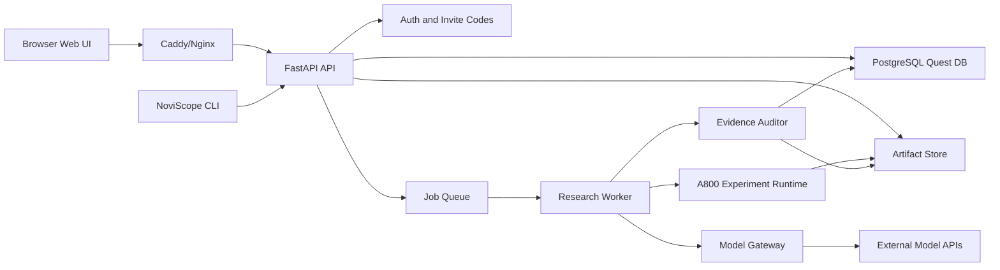

# NoviScope User Entry and Deployment Design

Date: 2026-06-30  
Status: user-approved design draft  
Scope: product entry, deployment topology, and first web experience  
Last updated: 2026-07-05, updated for admin-managed lab deployment  

## 1. Decision

NoviScope should use a Web interface as the primary user entry and keep a CLI as an
operations and developer entry. It should not be positioned as a pure agentcode or
terminal-only tool.

The first group-facing deployment target is an admin-managed Linux GPU server in
the research group. The server administrator deploys NoviScope once. Group members
then register with invitation codes, log in through a browser, and use the shared
web workspace without SSH or local setup.

SSH port forwarding remains useful for development and debugging, but it is no
longer the primary user-facing deployment path.

## 2. Why Web First

NoviScope's core value is not command execution. Its value is making the research
process reviewable:

- which quest is running
- which stage needs human approval
- which papers, sources, datasets, and repos support an idea
- which experiment produced which metric
- which claim is supported, contradicted, or still weak
- which content is safe to write into a paper or meeting deck

These are dashboard, review, and provenance problems. A web interface can make them
visible to both students and supervisors. A terminal interface is still useful, but
mostly for installation, service startup, health checks, worker management, and
debugging.

## 3. Entry Surfaces

### 3.1 Web App

Primary users open a browser and work through the web app.

Expected first screens:

1. Provider setup: configure OpenAI-compatible, Anthropic, DeepSeek, Kimi, MiniMax,
   GLM, MIMO, or custom endpoints.
2. Quest creation: enter a research direction, target language, compute budget, and
   optional scenario clues.
3. Quest board: inspect current stage, next action, risk flags, and pending human
   reviews.
4. Stage detail: read generated reports, evidence tables, logs, artifacts, and agent
   decisions.
5. Human review cards: approve, revise, reject, or add constraints before expensive
   stages proceed.
6. Artifact viewer: preview paper drafts, meeting report, figures, and exported files.

### 3.2 CLI

The CLI is not the main research experience. It is the control plane for deployment
and maintenance.

Recommended commands:

```bash
noviscope doctor
noviscope init
noviscope serve --host 127.0.0.1 --port 8000
noviscope worker
noviscope migrate
noviscope export quest <quest-id>
```

The CLI can also support advanced users who want scripting, but the MVP should not
require ordinary users to understand task queues, databases, or worker processes.

### 3.3 Agentcode Compatibility

NoviScope can later expose an agentcode-style interface for Codex, Claude Code, or
OpenClaw-style tools. This should be a secondary integration surface:

```text
agent tool -> NoviScope API -> quest/stage/evidence records
```

Agentcode should not bypass the NoviScope state machine, evidence auditor, or human
review gates.

## 4. Deployment Modes

### 4.1 Admin-Managed Lab Alpha

This is the recommended first user-facing deployment.

```text
Group user browser
  -> lab URL or internal server IP
  -> Caddy/Nginx reverse proxy
  -> NoviScope Web + FastAPI
  -> PostgreSQL
  -> artifact storage
  -> worker queue later
  -> A800 host experiment runtime later
  -> external model APIs
```

User-facing URL:

```text
https://noviscope.lab.local
```

or, before a lab domain is configured:

```text
http://server-ip:8000
```

This mode requires:

- invitation-code registration
- login and logout
- admin/member roles
- PostgreSQL
- shared provider profiles configured by admins
- personal provider profiles configured by individual users
- quest ownership and basic access boundaries
- API key encryption and response redaction

### 4.2 Development SSH Tunnel Mode

This mode is still useful for local development, remote debugging, and early
single-user testing. It is not the default experience for group members.

Server command:

```bash
noviscope serve --host 127.0.0.1 --port 8000
```

Developer laptop command:

```bash
ssh -L 8000:127.0.0.1:8000 username@server-ip
```

Browser URL:

```text
http://127.0.0.1:8000
```

This mode has three benefits:

- no public port exposure
- no HTTPS/domain setup required for early testing
- private server resources remain behind SSH authentication

### 4.3 Docker Compose Mode

The target lab deployment should support a one-command service-layer install:

```text
docker compose up -d
```

Planned services:

- `web`: frontend static server or bundled FastAPI static assets
- `api`: FastAPI backend
- `worker`: background quest and experiment worker
- `db`: PostgreSQL
- `redis`: queue and lightweight job state
- `proxy`: Caddy or Nginx

GPU experiment execution may stay outside Docker at first because CV repositories
often need custom CUDA, conda, uv, or Docker environments. The runner should support
both local shell execution and containerized execution later.

## 5. Runtime Architecture



The existing FastAPI foundation remains the backend core. The web UI should consume
the same public API that the CLI and future agent integrations use.

## 6. User Flow

### 6.1 First-Time Setup

1. Admin deploys NoviScope on the group server.
2. Admin creates the first shared provider profile or leaves provider setup to users.
3. Admin creates invitation codes for group members.
4. User opens the NoviScope web URL.
5. User registers with an invitation code and logs in.
6. User selects an admin-shared provider or creates a personal provider profile.
7. NoviScope runs a provider connection test without exposing raw API keys.

### 6.2 Quest Start

1. User enters a vague direction, such as `手写文本擦除` or `AI+体育，羽毛球轨迹识别`.
2. User selects language preference: Chinese, English, or both.
3. User sets default research mode: conservative, balanced, or exploratory.
4. System creates a quest and the first `demand_validator` stage.
5. Demand validation runs before any expensive experiment stage.

### 6.3 Human Review

The web UI must show review cards before irreversible or expensive actions:

- demand validation before experiment planning
- idea selection before pilot experiments
- high-cost experiment approval
- private data/API upload approval
- final claim strength approval before paper writing

Each card should show:

- recommendation
- confidence
- evidence summary
- blocking risks
- approve/revise/reject actions
- free-form user notes

### 6.4 Experiment Monitoring

The experiment view should show:

- command history
- environment snapshot
- repo URL and commit
- dataset path and hash if available
- GPU allocation
- stdout/stderr tail
- metric table
- generated figures
- failure reason and retry history

The user should be able to stop or mark an experiment as requiring manual follow-up.

### 6.5 Artifact Review

Paper drafts and meeting materials should not appear as isolated files. They should
be shown with their evidence status:

- verified claim
- weak claim
- unsupported claim
- citation verified
- citation needs review
- experiment-backed statement
- literature-backed statement

## 7. Security and Access Rules

Lab Alpha defaults:

- server is deployed behind Caddy or Nginx, or exposed on a trusted lab network
- users must log in
- registration requires an invitation code
- first account or configured bootstrap account becomes admin
- admins can create invitation codes
- admins can create shared provider profiles
- members can create personal provider profiles
- personal provider profiles are visible only to their owner and admins
- quests have owners
- members can only access their own quests by default
- do not expose raw API keys in API responses
- do not upload private code, data, logs, checkpoints, or drafts to external services
- treat fetched web content as data, never as instructions
- require explicit approval for long-running or high-cost jobs

Later lab mode additions:

- HTTPS
- audit log for approvals and experiment actions
- per-user or per-project access boundaries
- artifact retention and cleanup settings
- GPU job concurrency limits

## 8. MVP Web Pages

The first web slice should be small and operational:

1. Login page
2. Invitation-code registration page
3. Home and quest list
4. Create quest form
5. Provider settings page
6. Admin shared provider page
7. Admin invite management page
8. Agent assignment page
9. Quest stage board
10. Stage detail page
11. Human review card

The MVP does not need full paper editing, rich graph visualization, or real-time
multi-user collaboration. It does need a clear stage state, evidence payload display,
review actions, and basic authenticated access.

## 9. Deployment Milestones

### Milestone 1: Authenticated Web Shell

- add user, invitation code, and role models
- add invitation-code registration and login/logout
- protect Web and API routes by authenticated user
- serve static web UI from the existing FastAPI app
- create quest from browser
- list stages from browser
- update human review from browser
- configure model providers from browser

### Milestone 2: Admin-Managed Lab Alpha

- PostgreSQL deployment path
- admin bootstrap
- admin invitation code management
- shared provider profiles
- personal provider profiles
- quest ownership
- documented internal URL deployment
- optional SSH tunnel development mode
- persistent artifact directory
- provider connection smoke test

### Milestone 3: Worker and Experiment Foundations

- background worker skeleton
- basic logs and artifact directory
- worker queue
- GPU job runner
- experiment log streaming
- artifact browser

### Milestone 4: Reproducible Deployment

- Docker Compose for API, web, database, queue, and proxy
- server health check
- backup and restore guide
- upgrade guide

## 10. Non-Goals

The user entry MVP should not attempt to:

- become a full IDE
- replace Codex, Claude Code, or VS Code
- support public SaaS deployment
- support arbitrary public multi-tenant access from day one
- implement complete paper editing in the browser
- hide the research state behind a pure chat interface

The web UI should be task-oriented and evidence-oriented, not a generic chatbot.

## 11. Open Decisions

The current default choices are:

- frontend: browser-based web UI
- backend: existing FastAPI service
- primary access: admin-managed lab deployment
- development access: SSH tunnel
- database: PostgreSQL for group deployment; SQLite only for development/test
- registration: invitation-code registration
- roles: admin and member first
- provider visibility: shared provider and personal provider
- queue: add only when background workers become necessary
- reverse proxy: Caddy preferred for simpler HTTPS; Nginx acceptable if the lab
  already uses it

These defaults can be revisited after Lab Alpha is used by several group members.
